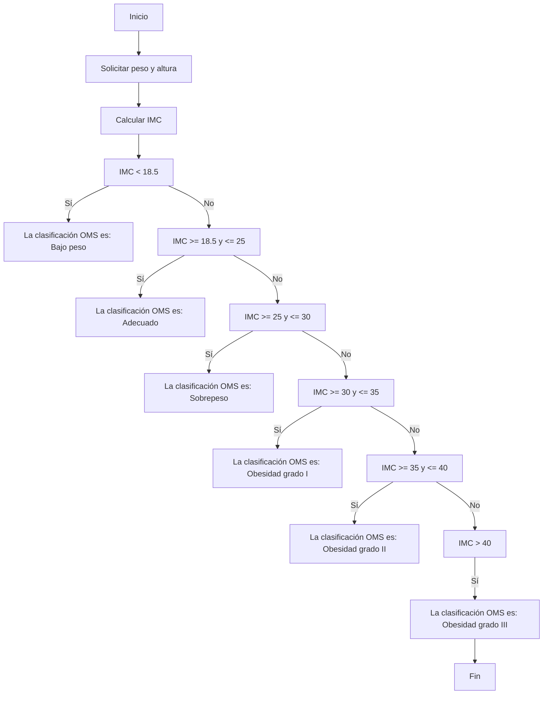

# Titulo del proyecto

Desafío sentencias condicionales e iterativas

## Descripción del proyecto

Realizar 2 ejercicios aplicando los conceptos aprendidos en clase:
Actividad 1 - IMC
Se solicita crear el programa imc.py que permita calcular el IMC de una persona.

1. Al programa se debe ingresar el peso en Kg y la talla (altura) en centímetros.
   (1 Puntos)
2. Calcular el IMC ajustando los valores de entrada a las unidades requeridas por la
   fórmula. El resultado se debe informar con 2 decimales.
   (2 Puntos)
3. Entregar al usuario una salida acorde que permita conocer el valor de su IMC
   además de la clasificación dada por la OMS.
   (2 Puntos)

Actividad 2 - Cachipún

1. Se pide crear el programa cachipun.py, donde el usuario entregará como
   argumento: piedra, papel o tijera. Para que el computador pueda jugar escogerá un
   valor al azar. Para eso se solicita investigar random.choice() de la librería random.
   (1 Puntos)
1. Considerar las opciones de ganar, perder o empatar con la computadora.
   (2 Puntos)
1. En caso que el argumento sea distinto a piedra, papel o tijera, el programa debe
   mostrar las opciones que se pueden jugar.
   (2 Puntos)

## Diagramas de flujo

Diagrama de flujo Ejercicio IMC



Diagrama de flujo Ejercicio Cachipun

´´´mermaid
´´´

## Prerrequisitos o Dependencias

Lista de software y herramientas, incluyendo versiones, que necesitas para instalar y ejecutar este proyecto:

- Sistema Operativo Window, Linux, MacOS
- Lenguaje de programación python

## Instalación del Proyecto

Una guía paso a paso sobre cómo configurar el entorno de desarrollo e instalar todas las dependencias.

```bash
# git clone git@github.com:KarenLimari/desafiosentencias_cond_iter.git
```

## Instrucciones para Ejecutar el Proyecto

Instrucciones para ejecutar el proyecto una vez instalado.

```bash
#
```

## Autor

-Karen Limari [Karen Limari](github.com/KarenLimari)
-Ambar Zambrano [Ambar Zambrano](github.com/ambarzambranor)

## Licencia

Este proyecto está bajo la Licencia MIT - ve el archivo [LICENSE.md](LICENSE) para detalles
